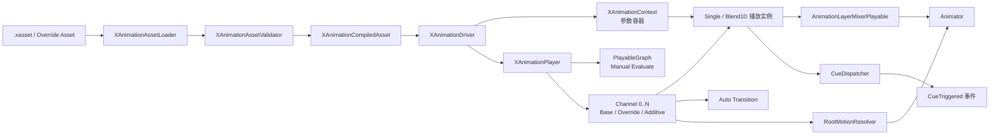
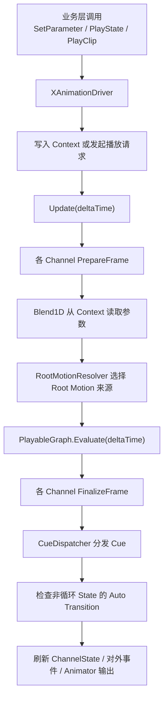

# XFramework XAnimation 播放系统

> `XAnimation` 是基于 Unity Playables 的轻量动画播放系统，核心代码位于 `Runtime/Tools/Animation/`，统一命名空间为 `XFramework.Animation`。它用 `.xasset` 文本配置描述动画通道、状态、动画片段、事件点和换装覆盖关系，运行时由 `XAnimationDriver` 手动驱动播放。

---

## 1. 概述

- 核心源码目录：[`Runtime/Tools/Animation/`](../Runtime/Tools/Animation/)
- README 入口：[`README.md`](../README.md)
- 适合希望通过代码显式控制动画状态、混合层和事件点，而不是为简单角色维护复杂 Animator Controller 的场景。
- `XAnimation` 的设计初衷就是不引入 Animator Controller 风格的状态机；业务状态切换由代码显式维护，资源层只提供播放描述和轻量自动流转能力。

### 1.1 适用场景

- 需要用代码显式播放动画状态，不想为简单角色维护复杂 Animator Controller。
- 需要 Base / Override / Additive 多通道混合，并可选 `AvatarMask`。
- 需要 1D Blend，例如 `idle / walk / run` 随速度参数连续混合。
- 需要按动画归一化时间触发脚步、攻击判定、音效等 `Cue` 事件。
- 需要通过 Override Asset 复用同一套动作 key，只替换部分角色动画资源。

### 1.2 架构总览

下面这张图可以直接把 `XAnimation` 的核心分层和数据流看清楚：



可以把它理解成 4 层：

- 资源层：`.xasset` / Override Asset 只描述通道、片段、状态、参数、Cue 和自动切换规则。
- 编译层：`XAnimationAssetLoader` 负责加载、合并 Override、校验配置，并生成 `XAnimationCompiledAsset`。
- 驱动层：`XAnimationDriver` 负责对外暴露播放与参数接口，内部持有 `XAnimationContext` 和 `XAnimationPlayer`。
- 播放层：`XAnimationPlayer` 维护 Unity `PlayableGraph`、多个 `Channel`、Cue 分发和 Root Motion 解析。

### 1.3 一帧是怎么跑的



几个关键点：

- `XAnimation` 的“图”只有 Unity `PlayableGraph`，它是播放图，不是状态机图。
- `XAnimation` 的核心思路是“状态决策交给代码，动画播放交给资源描述”。
- 状态切换入口只有两类：业务层显式 `PlayState / PlayClip`，或非循环 state 命中 `autoTransitions` 后自动回落/衔接。
- `Blend1D` 不自己决定切换到哪个 state，它只负责当前 state 内部的样本混合。
- `Cue` 和 Root Motion 都是在播放层按当前实际输出结果计算，而不是靠 Animator Controller 状态机回调。

---

## 2. 资源创建与预览

- 菜单 **`XFramework/Tools/XAnimation Preview`** 可打开预览与编辑窗口。
- `XAnimation / Override Asset` 支持加载普通 XAnimation Asset 或 Override Asset。
- 普通资源可编辑 `Channels`、`States`、`Clips`、`Parameters`、`Cues`，并可预览 state 播放；Override 资源只覆盖已有 clip 的 `clipPath`，不会修改 base 资源结构。
- 预览窗口会在当前 tab 真正可见时才推进动画和执行渲染；如果窗口被其他 tab 或其他编辑器界面覆盖，会自动暂停后台预览，避免持续占用编辑器 CPU / GPU。
- 预览窗口的相机渲染默认走稳定优先配置：关闭 HDR 与 MSAA，以降低 Unity 6000 + D3D12 下的预览渲染压力。
- 调试 UI 采用“局部连续刷新 + 事件驱动刷新”：
  - `Channel` 调试区中的 `normalizedTime / totalNormalizedTime / weight / speed / nextStateKey / Blend` 等连续数值，会在预览可见且动画实际推进时同步更新。
  - `State / Clip` 高亮、暂停 / 停止按钮状态、`Cue Log` 列表等非连续区域，只会在播放状态变化、Cue 追加或用户操作时刷新。
- 切回 `XAnimation Preview` 时，窗口会立即同步当前预览状态，不会在后台偷偷累计时间后一次性快进。
- 示例资源可参考 `Assets/Animation/XAnimationSamples/XAnimationPreview_WolfLite.xasset` 与 `XAnimationOverride_WolfLite.xasset`。

---

## 3. 配置结构

普通 XAnimation Asset 的核心字段如下：

```json
{
  "alias": "hero",
  "channels": [
    {
      "name": "base",
      "layerType": "Base",
      "defaultWeight": 1.0,
      "maskPath": "",
      "allowInterrupt": true,
      "defaultFadeIn": 0.15,
      "defaultFadeOut": 0.15,
      "canDriveRootMotion": true
    }
  ],
  "clips": [
    {
      "key": "idle",
      "clipPath": "Assets/Art/Hero/Hero.fbx|Idle"
    }
  ],
  "states": [
    {
      "key": "idle",
      "stateType": "Single",
      "clipKey": "idle",
      "channelName": "base",
      "fadeIn": 0.15,
      "fadeOut": 0.15,
      "speed": 1.0,
      "loop": true,
      "rootMotionMode": "Inherit"
    },
    {
      "key": "locomotion",
      "stateType": "Blend1D",
      "channelName": "base",
      "parameterName": "moveSpeed",
      "fadeIn": 0.15,
      "fadeOut": 0.15,
      "speed": 1.0,
      "loop": true,
      "rootMotionMode": "Inherit",
      "samples": [
        { "clipKey": "idle", "threshold": 0.0 },
        { "clipKey": "walk", "threshold": 1.0 },
        { "clipKey": "run", "threshold": 3.0 }
      ]
    }
  ],
  "autoTransitions": [
    {
      "preStateKey": "attack",
      "nextStateKey": "idle",
      "ExitTime": 0.9,
      "TransitionDuration": 0.1,
      "EnterTime": 0.0
    }
  ],
  "parameters": [
    {
      "name": "moveSpeed",
      "type": "Float",
      "defaultValue": 0.0
    }
  ],
  "cues": [
    {
      "clipKey": "idle",
      "time": 0.5,
      "eventKey": "footstep",
      "payload": "L"
    }
  ]
}
```

字段说明：

- `channels`：动画混合通道。`layerType` 支持 `Base`、`Override`、`Additive`；`maskPath` 可绑定 `AvatarMask`；`canDriveRootMotion` 表示该通道是否允许驱动 Root Motion。
- `clips`：动画片段索引，是 state 引用的叶子资源，只描述 `key` 与 `clipPath`。`clipPath` 支持普通资源路径，也支持 `FBX路径|子动画名`。
- `states`：业务播放单位。`Single` 引用一个 `clipKey`；`Blend1D` 绑定一个 Float 参数和若干采样点，运行时只混合相邻两个采样 clip；channel、fade、loop、speed、Root Motion 等播放语义都属于 state。
- `autoTransitions`：状态自动切换配置。用于声明某个非循环 state 在播放到指定进度后，自动切到下一个 state，并可指定切换时长与目标状态起播时间。
- `parameters`：状态运行时参数，支持 `Float`、`Int`、`Bool`、`Trigger`。`Blend1D` 每帧从 `XAnimationContext` 读取绑定的 Float 参数。
- `cues`：动画事件点。`time` 是 `[0, 1]` 归一化时间；循环动画每轮都会按 `loopCount` 分发一次。

Override Asset 用于复用 base 配置，只替换指定 clip：

```json
{
  "baseAssetPath": "Assets/Animation/Hero/Hero.xasset",
  "clips": [
    {
      "key": "run",
      "clipPath": "Assets/Animation/HeroSkin/HeroSkin_Run.anim"
    }
  ]
}
```

### 3.1 Auto Transition 配置

`autoTransitions` 用于描述“某个状态播放到一定进度后，自动切换到另一个状态”的轻量规则。它不是状态机条件系统，而是给那些业务上已经确定流向、只是不想每次都手写收尾切换的场景用的，例如 `jumpStart -> jumpLoop`、`attack -> idle`、`hit -> recover`、`open -> idle`。

```json
{
  "autoTransitions": [
    {
      "preStateKey": "attack",
      "nextStateKey": "idle",
      "ExitTime": 0.9,
      "TransitionDuration": 0.1,
      "EnterTime": 0.0
    }
  ]
}
```

- `preStateKey`：当前播放完后要离开的状态 key。
- `nextStateKey`：自动切换到的目标状态 key；为空时表示当前状态播完后直接停止。
- `ExitTime`：当前状态播放到哪个 normalized time 时触发自动切换，范围 `[0, 1]`。
- `TransitionDuration`：自动切换过渡时长；当值 `<= 0` 时，会回退到目标 state 自身的 `fadeIn / fadeOut`。
- `EnterTime`：目标状态从哪个 normalized time 开始播放，范围 `[0, 1]`。

编辑器中的 `XAnimation Preview` 已提供对应的 Auto Transition 编辑区，可直接配置 `preState`、`nextState`、`ExitTime`、`TransitionDuration` 与 `EnterTime`，并通过时间轴可视化观察切换时机。

适合交给 `autoTransitions` 的情况：

- 某个非循环动作播到特定进度后，后续去向是固定的。
- 这个流转不依赖复杂条件判断，只依赖“播到了哪里”。
- 你希望资源层顺手描述这一跳，减少业务代码里重复写“播完接下一个 state”。

不适合交给 `autoTransitions` 的情况：

- 下一状态取决于输入、移动方向、战斗判定、技能阶段或其他运行时业务条件。
- 同一个状态可能根据上下文跳向多个不同目标。
- 你需要完整状态机、条件图或 Any State 一类的行为。

这些情况应该继续由业务代码自行决定，并在合适时机显式调用 `PlayState`。

---

## 4. 运行时使用方式

业务侧通常持有一个 `XAnimationDriver`，在对象初始化时绑定资源和 `Animator`，在每帧 `Update` 中手动推进。

```csharp
using UnityEngine;
using XFramework.Animation;

public sealed class HeroAnimationController : MonoBehaviour
{
    [SerializeField] private Animator m_Animator;
    [SerializeField] private string m_AnimationAssetPath = "Assets/Animation/Hero/Hero.xasset";

    private readonly XAnimationDriver m_Driver = new XAnimationDriver();

    private void Awake()
    {
        m_Driver.Initialize(m_AnimationAssetPath, m_Animator);
        m_Driver.CueTriggered += OnCueTriggered;
        m_Driver.PlayState("idle");
    }

    private void Update()
    {
        m_Driver.Update(Time.deltaTime);
    }

    public void PlayRun()
    {
        m_Driver.SetParameter("moveSpeed", 3f);
        m_Driver.PlayState("locomotion");
    }

    public void PlayAttack()
    {
        m_Driver.PlayState("attack", new XAnimationTransitionOptions
        {
            fadeIn = 0.08f,
            fadeOut = 0.12f,
            priority = 10,
            interruptible = true,
        });
        m_Driver.SetChannelTimeScale("upperBody", 1f);
    }

    private void OnCueTriggered(XAnimationCueEvent cueEvent)
    {
        if (cueEvent.eventKey == "footstep")
        {
            Debug.Log($"Footstep: {cueEvent.payload}");
        }
    }

    private void OnDestroy()
    {
        m_Driver.CueTriggered -= OnCueTriggered;
        m_Driver.Dispose();
    }
}
```

常用控制接口：

- `PlayState(string stateKey, XAnimationTransitionOptions transition = default)`：按 state key 播放，始终使用 state 自己配置的 channel，推荐业务层统一使用。
- `PlayClip(string clipKey, string channelName, XAnimationTransitionOptions transition = default)`：底层/调试接口，按 clip key 直接播放；必须显式提供 `channelName`。
- `SetParameter(key, float/int/bool)` / `SetTrigger(key)`：写入运行时参数，`Blend1D` 默认从 Float 参数读取混合值。
- `Stop(channelName, fadeOut)` / `StopAll(fadeOut)`：停止指定通道或全部通道。
- `SetChannelWeight(channelName, weight)`：调整通道混合权重。
- `SetChannelTimeScale(channelName, timeScale)`：调整通道时间缩放，最小值会被限制为 0。
- `SetRootMotionEnabled(enabled)`：全局启停 Root Motion 输出。
- `GetChannelState(channelName)`：查询当前播放 clip、归一化时间、权重、速度、优先级等调试信息。

### 4.1 更省事的组件封装：XAnimationActor

如果业务不想自己维护 `XAnimationDriver` 生命周期，可以直接挂 `XAnimationActor`：

- `XAnimationActor` 会在 `Awake` / `Start` / `Update` 中帮你处理初始化、手动推进和可选的起始 state。
- 它本质上只是 `XAnimationDriver` 的 `MonoBehaviour` 包装层，不会引入额外状态机语义。
- 适合做角色预制体上的直接挂载；如果你需要更细粒度的接管，仍建议直接持有 `XAnimationDriver`。

运行关系可以简单理解为：

```text
MonoBehaviour(Update)
  -> XAnimationActor
    -> XAnimationDriver
      -> XAnimationPlayer
        -> PlayableGraph / Animator
```

---

## 5. 规则与注意事项

### 5.1 打断与 Root Motion 规则

- 同一 channel 内播放新 state 时，会把当前 state 作为 previous 输入淡出，新 state 作为 current 输入淡入。
- `Blend1D` 的子 clip 混合只负责状态内部权重，不负责跨状态自动过渡。
- 当 channel 的 `allowInterrupt = false`，或当前播放请求设置 `interruptible = false` 时，新请求不能打断当前播放。
- 新请求只有在 `priority >= 当前播放 priority` 时才能打断。
- Root Motion 默认由 `channel.canDriveRootMotion` 决定；state 可用 `rootMotionMode` 设置 `ForceOn` / `ForceOff` 覆盖。
- `Additive` channel 不能驱动 Root Motion。

### 5.2 Auto Transition 自动切换规则

- `autoTransitions` 只对非循环 state 生效；循环 state 不能配置自动切换。
- 每个 `preStateKey` 只能配置一条 auto transition，不能重复。
- `preStateKey` 和 `nextStateKey` 都必须指向已存在的 state，且不能自跳转到自己。
- 当前 state 的总归一化时间达到 `ExitTime` 后，运行时会自动发起一次 `Play`：
  - 目标 state 为 `nextStateKey`
  - `enterTime` 直接写入过渡参数
  - `priority` 继承当前播放状态
  - `interruptible` 强制为 `true`
- 当 `TransitionDuration > 0` 时，自动切换会统一使用该值作为 `fadeIn / fadeOut`。
- 当 `TransitionDuration <= 0` 时，自动切换会回退到目标 state 自身配置的 `fadeIn / fadeOut`。
- 如果配置了 auto transition 但 `nextStateKey` 为空，当前状态播到退出点后会直接停止，而不是切到别的状态。

### 5.3 资源加载规则

默认解析器 `XAnimationRuntimeAssetResolver` 通过 `ResourceManager` 加载资源：

- `.xasset` 文本资源：`ResourceManager.Instance.Load<TextAsset>(assetPath)`。
- 普通 `AnimationClip`：`ResourceManager.Instance.Load<AnimationClip>(clipPath)`。
- FBX 子动画：`clipPath` 写为 `Assets/Path/Model.fbx|ClipName`，内部会调用 `LoadSubAsset<AnimationClip>`。
- `AvatarMask`：`ResourceManager.Instance.Load<AvatarMask>(maskPath)`。

### 5.4 系统边界

为了避免把系统理解成 Animator Controller 的替代状态机，建议把 `XAnimation` 的边界记成下面这样：

- 它负责“播放什么、怎么混、什么时候触发 Cue、什么时候自动回落”。
- 它不负责“复杂状态决策图、条件分支图、Any State、子状态机”。
- 复杂业务状态判断应该留在业务代码里，再由业务代码调用 `PlayState` 或写入参数驱动 `Blend1D`。
- 如果一个动作只需要“播完自动回 idle / locomotion”或“固定衔接到下一个阶段”，优先用 `autoTransitions`，不要把业务状态判断塞进资源层。

> [!IMPORTANT]
> `XAnimationDriver` 创建的是手动更新的 PlayableGraph，必须每帧调用 `Update(deltaTime)`；对象销毁或换资源前必须调用 `Dispose()`，否则 PlayableGraph 不会释放。
