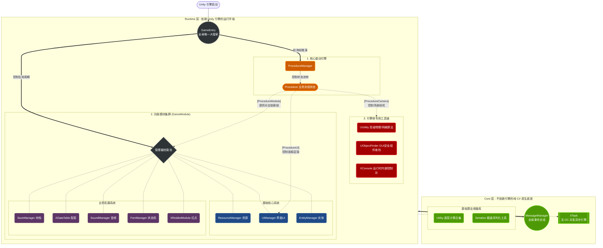

# XFramework 开发手册 (Master Guide)

> XFramework 是一套以模块化、高解耦、工具链完备为核心的 Unity 框架。
> 本文档将为您提供框架核心模块、扩展模块及实用工具库的详细说明，帮助您快速搭建现代化的游戏架构。

---

## 1. 架构 (Architecture)
框架在物理与逻辑层被分为两大部分：
- **`Core` (纯 C# 层)**：提供独立于游戏引擎的抽象与底层算法（如状态机、对象池、集合、底层消息中心）。
- **`Runtime` (Unity 层)**：基于 Unity 引擎封装的具体模块实现（如资源管理、实体管理、UI系统）。

**基本原则：**
- 模块生命周期由 `GameEntry` 统一调度。不要散乱地创建"带 MonoBehaviour 的单例"。
- 使用 `[DependenceModule(typeof(OtherModule))]` 定义模块的加载顺序。
- 通过 `ManagerName.Instance` 形式访问各个模块及功能。

### 1.1 架构流程图 (Architecture Flowchart)



### 1.2 目录索引 (Quick Links)
| 功能模块           | 源码目录                                                 | 详细介绍                                                                          |
| :----------------- | :------------------------------------------------------- | :-------------------------------------------------------------------------------- |
| **驱动核心**       | [Runtime/Base/Procedure/](./Runtime/Base/Procedure/)     | [流程管理 (`ProcedureManager`)](#2-核心驱动游戏流程-core-driver-proceduremanager) |
| **资源系统**       | [Runtime/Modules/Resource/](./Runtime/Modules/Resource/) | [资源加载 (`ResourceManager`)](#31-资源管理-resourcemanager)                      |
| **实体系统**       | [Runtime/Modules/Entity/](./Runtime/Modules/Entity/)     | [对象池与实体 (`EntityManager`)](#32-实体与对象池-entitymanager)                  |
| **UI 系统**        | [Runtime/Modules/UI/](./Runtime/Modules/UI/)             | [自动化界面 (`UIManager`)](#33-ui-界面系统-uimanager)                             |
| **通信系统**       | [Core/Messenger/](./Core/Messenger/)                     | [消息系统 (`MessageManager`)](#34-消息广播系统-messagemanager)                    |
| **任务系统**       | [Runtime/Modules/Task/](./Runtime/Modules/Task/)         | [异步任务 (`XTask`)](#35-异步与并发处理-xtask)                                    |
| **持久化**         | [Runtime/Modules/Save/](./Runtime/Modules/Save/)         | [存档系统 (`SaveManager`)](#41-存档持久化-savemanager)                            |
| **数据配置**       | [Runtime/Modules/Data/](./Runtime/Modules/Data/)         | [配表系统 (`XDataTable`)](#42-数据表驱动配置-xdatatable)                          |
| **状态机**         | [Runtime/Modules/FSM/](./Runtime/Modules/FSM/)           | [有限状态机 (`FSM`)](#44-任务序列与有限状态机-task--fsm)                          |
| **工具库 (Core)**  | [Core/Utility/](./Core/Utility/)                         | [通用工具 (`Utility`)](#51-通用底层-utility)                                      |
| **工具库 (Unity)** | [Runtime/Tools/](./Runtime/Tools/)                       | [引擎工具 (`UUtility`)](#52-引擎特定高级工具-uutility)                            |
| **控制台**         | [Runtime/Tools/XConsole/](./Runtime/Tools/XConsole/)     | [XConsole 运行时控制台](#55-xconsole-运行时控制台)                                |

---

## 2. 核心驱动 (Core Driver: ProcedureManager)
`ProcedureManager` 是 XFramework 的灵魂，它不仅是一个状态机，更是驱动整个游戏生命周期的"指挥官"。

### 2.1 基础流程控制 (ProcedureBase)
所有业务流程的基类，本质上是一个拥有增强生命周期的有限状态机节点。

#### 核心生命周期钩子
- **`OnInit()`**: 流程首次创建时触发（全局仅一次），适合初始化不随状态切换改变的数据。
- **`OnEnter(ProcedureBase preProcedure)`**: 进入流程时触发。`preProcedure` 参数指示了来源流程。
- **`OnUpdate()`**: 每帧轮询逻辑。
- **`OnExit()`**: 离开流程时触发。
- **`OnPrepare(Action onReady)`**: **[关键]** 异步准备阶段。
  - 框架在 `OnEnter` 之后会立即调用此方法。
  - 当重写并执行异步操作（如加载特定资源、预置数据）时，必须在完成后调用 `onReady()`。
  - **只有在 `onReady` 执行后**，框架才会通过特性加载该流程依赖的 `Module` 和显示 `UI`。

#### 进阶功能
- **事件自动绑定**: 继承 `ProcedureWithEvent` 可实现类内 `[EventListener]` 特性方法的自动注册与注销。
- **内置子流程 (SubProcedure)**: 
  - 支持在大流程内部进行二次状态拆分（如：战斗流程中的"部署"、"开战"、"结算"）。
  - 使用 `ChangeSubProcedure<T>(args)` 进行内部切换。
- **全局重置 (ChangeProcedure(null))**: 
  - 当切换到空流程时，框架会自动检测并清理当前所有 `Procedure` 生命周期绑定的模块及 UI 面板，确保系统状态彻底归零。

### 2.2 扩展流程类型
针对不同业务场景，框架预设了以下扩展：
- **SceneProcedureBase**：专为包含场景切换的流程设计。
  - `ScenePath`：重写以指定 Unity 场景。
  - 自动处理了 `OnPrepare` 中的场景加载逻辑，并在 `OnSceneLoaded()` 钩子中通知业务层。
- **SubProcedureBase**：子流程基类。
  - 通过 `Parent` 属性（`SubProcedureBase<T>`）可安全访问所属的大流程实例。

### 2.3 驱动机制 (Automatic Drivers)
流程通过特性自动驱动其他系统，实现配置化、声明式的逻辑切换：
1. **模块驱动 (`[ProcedureModule]`)**：进入流程时自动加载所需的业务 Module（见 5.5 节）。
2. **UI 驱动 (`[ProcedureUI]`)**：根据名称自动打开/关闭对应的 UI 面板，实现"所见即所得"的界面切换体验。
3. **相机驱动 (`[ProcedureCamera]`)**：**[New]** 声明流程所需的相机名称。进入阶段时，框架将通过 `UObjectFinder` 查找并激活该相机，并自动关闭前一个相机的激活状态。
   - **优先级规则**：系统会优先应用子流程（SubProcedure）指定的相机；若子流程未声明，则回退并应用父流程的配置。
   - **核心依赖**：依赖场景中需要切换的相机对象挂载 `UObjectReference`。

### 2.4 完整流程编写示例 (Usage Example)
以下是一个典型的游戏流程代码示例，展示了如何结合特性与生命周期钩子：

```csharp
using XFramework;
using Action = System.Action;

// 1. 定义流程依赖：自动加载模块、打开 UI、激活相机
[ProcedureModule(typeof(BattleModule))]
[ProcedureUI("BattlePanel")]
[ProcedureCamera("MainCamera")]
public class BattleProcedure : SceneProcedureBase
{
    // 指定该流程关联的 Unity 场景路径
    protected override string ScenePath => "Assets/Scenes/MainBattle.unity";

    // 2. 异步准备：正式开始前加载特定资源
    public override void OnPrepare(Action onReady)
    {
        // 调用基类处理场景加载
        base.OnPrepare(async () => 
        {
            // 加载战斗所需的音效/配置（示意）
            await ResourceManager.Instance.LoadAsync<AudioClip>("BGM_Battle");
            
            // 准备完毕，通知框架继续后续流程（加载 Module、打开 UI）
            onReady();
        });
    }

    public override void OnEnter(ProcedureBase preProcedure)
    {
        base.OnEnter(preProcedure);
        // 执行入场逻辑，如初始化战斗管理器
        BattleModule.Instance.StartBattle();
    }

    public override void OnUpdate()
    {
        base.OnUpdate();
        // 监测战斗是否结束
        if (BattleModule.Instance.IsBattleEnd)
        {
            // 3. 切换流程：跳转至大厅
            ProcedureManager.Instance.ChangeProcedure<LobbyProcedure>();
        }
    }
}
```

---

## 3. 核心系统模块 (Core Modules)

### 3.1 资源管理 (ResourceManager)
XFramework 提供了一套高度抽象、接口统一且支持引用计数的资源管理系统。它在底层抹平了 **Resources**、**AssetDatabase (Editor)** 和 **AssetBundle** 的差异，并内置了高效的 **对象池 (Object Pooling)** 机制。

#### 1. 核心架构与加载策略
系统通过 `IResourceLoadHelper` 接口实现不同的加载后端。开发者无需关心当前是单机包还是热更包：
- **Editor 环境**：默认使用 `AssetDataBaseLoadHelper` 模拟加载，无需打 AB 包即可快速迭代。
- **Runtime 环境**：自动切换至 `AssetBundleLoadHelper`，支持依赖项自动分析与加载。
- **特定需求**：如果需要从 Unity 原生 `Resources` 文件夹加载，可使用带 `InResources` 后缀的方法，正常情况下不建议使用。

#### 2. 基础资源加载 (Assets)
加载贴图、材质、配置等非 GameObject 资源：
```csharp
// 1. 同步加载
Texture2D tex = ResourceManager.Instance.Load<Texture2D>("Assets/Art/Icon_01.png");

// 2. 异步加载 (支持 await)
AudioClip clip = await ResourceManager.Instance.LoadAsync<AudioClip>("BGM_Login");

// 3. 异步加载 (回调模式)
ResourceManager.Instance.LoadAsync<TextAsset>("GameConfig", (success, asset) => {
    if(success) Debug.Log(asset.text);
});
```

#### 3. 实例化与对象池 (Instantiation & Pooling)
针对 `GameObject`，框架提供了自动化的引用计数与池化管理。

**A. 普通实例化 (No Pool)**
仅利用路径管理功，生命周期由用户完全控制：
```csharp
var go = ResourceManager.Instance.Instantiate<GameObject>("Hero_Player");
// ... 逻辑处理 ...
ResourceManager.Instance.Release(go); // 统一使用 Release 接口
```

**B. 对象池实例化 (By Pool) —— 推荐**
内置 LRU (Least Recently Used) 清理机制，适合高频产生的子弹、特效等：
```csharp
// 从池中获取或异步加载并创建
var bullet = await ResourceManager.Instance.InstantiateAsyncByPool<GameObject>("Wfx_Bullet_01");

// 释放回池
ResourceManager.Instance.Release(bullet); 
```
> [!NOTE]
> **自动清理机制**：池中空闲对象默认在 60 秒后自动销毁并释放底层 AB 引用，无需担心内存内存溢出。

#### 4. 资源释放原则
**统一原则：所有通过 `ResourceManager` 加载或实例化的对象，必须通过 `ResourceManager.Instance.Release(obj)` 释放。**
- 如果是池化对象，它会回收到池中。
- 如果是普通对象，它会被销毁或解除对 AssetBundle 的引用计数。
- 当 AssetBundle 的引用计数归零时，框架会自动调用 `Unload(true)`。

### 3.2 实体与对象池 (EntityManager)
为角色、怪物、子弹等提供池化管理与复杂的逻辑层级维护。
- **分配/回收**：
  ```csharp
  var enemy = EntityManager.Instance.Allocate<EnemyEntity>(enemyPrefab);
  EntityManager.Instance.Recycle(enemy); // 必须回收，不可 Destroy
  ```
- **层级管理**：使用 `Attach()` / `Detach()` 控制逻辑父子级关系（如将武器 Entity 附着在角色 Entity 的特定部位上）。

### 3.3 UI 界面系统 (UIManager)
基于自动化特性的纯 C# 界面管理。
- **配置面板**：
  ```csharp
  [PanelInfo("InventoryPanel", "Assets/UI/Inventory.prefab", PanelLevel.Medium)]
  public class InventoryPanel : PanelBase { ... }
  ```
- **控制界面**：
  ```csharp
  UIManager.Instance.OpenPanel("InventoryPanel", initData);
  UIManager.Instance.ClosePanel("InventoryPanel");
  ```
#### 3.3.1 UI 面板编写示例 (Usage Example)
继承 `PanelBase` 即可快速创建一个由框架管理的界面：

```csharp
using XFramework.UI;
using XFramework.Event;
using UnityEngine.UI;

// 1. 定义面板元数据：名称、资源路径、层级
[PanelInfo("HomePanel", "Assets/Art/UI/HomePanel.prefab", PanelLevel.Medium)]
public class HomePanel : PanelBase
{
    private Button m_StartBtn;
    private Text m_TitleText;

    // 2. 初始化：只会在面板首次加载时调用一次
    protected override void OnInit()
    {
        // 使用索引器快速查找组件（内部会自动缓存，比 transform.Find 高效且安全）
        m_StartBtn = this["Start_Btn"].As<Button>(); 
        m_TitleText = this["Title_Txt"].As<Text>();

        // 绑定按钮点击
        m_StartBtn.onClick.AddListener(() => {
            UIManager.Instance.OpenPanel("InventoryPanel");
        });
    }

    // 3. 打开界面：每次调用 OpenPanel 时触发，args 为传入参数
    public override void OnOpen(params object[] args)
    {
        base.OnOpen(args); // 必须调用，会自动注册 [EventListener]
        
        string userName = args.Length > 0 ? (string)args[0] : "Player";
        m_TitleText.text = $"Welcome, {userName}!";
    }

    // 4. 事件监听：自动注册/卸载，无需手动管理
    [EventListener("OnGoldChange")]
    private void UpdateGold(int amount)
    {
        // 处理金币变更显示...
    }

    public override void OnClose()
    {
        // 自动卸载 [EventListener]，此处可处理其他自定义清理
        base.OnClose();
    }
}
```

> [!TIP]
> **关于组件查找**：`this["Name"]` 依赖于 Prefab 中挂载了 `GUComponent` 的节点。这种方式解耦了层级路径，即使策划修改了 UI 节点的父子关系，只要名称不变，代码依然有效。

### 3.4 消息广播系统 (MessageManager)
基于字符串事件名的全局消息中心，实现模块间的极致解耦。框架极度推崇使用 **"自动化特性绑定"** 以替代繁琐的手动注册。

#### 1. 自动化绑定机制 (EventListener)
通过在方法上添加 `[EventListener]` 特性，框架会利用 `EventRegisterHelper` 自动识别并绑定对应的事件。

**推荐写法示例：**
```csharp
// 监听"玩家死亡"消息，支持最多 3 个泛型参数
[EventListener("OnPlayerDead")]
private void HandlePlayerDead(string playerName, int score)
{
    Debug.Log($"{playerName} was dead. Final score: {score}");
}
```

#### 2. 底层原理与生命周期管理
`EventRegisterHelper` 会在内部扫描目标类的所有方法，并将其包装为高效的 `Delegate`。
- **框架基类支持**：
  - `PanelBase`：在 `OnOpen` 时注册，`OnClose` 时注销。
  - `ProcedureWithEvent`：进入流程时注册，离开时注销。
  - `GameModuleWithEvent`：模块初始化时注册，销毁时注销。
- **如果你在普通类中使用**：
  需手动持有 `EventRegisterHelper` 实例，在合适时机调用 `Register()` 和 `UnRegister()`。

#### 3. 手动模式 (极少场景)
虽然不推荐，但在需要极致动态控制监听的场景下可以手动调用：
```csharp
// 注册
MessageManager.Instance.AddListener("OnUpdate", MyCallback);
// 注销
MessageManager.Instance.RemoveListener("OnUpdate", MyCallback);
// 广播
MessageManager.Instance.BroadCast("OnUpdate", arg1, arg2);
```

> [!IMPORTANT]
> **开发指南**：如果你的类继承自 XFramework 的系统基类，请优先查找对应的 `WithEvent` 版本（如 `SubProcedureWithEvent`），它们能够确保事件在正确的生命周期内被清理，有效规避内存泄露风险。

### 3.5 异步与并发处理 (XTask)

---

## 4. 实用工具合集 (Utility & Tools)

### 4.1 通用底层 `Utility`

> [!TIP]
> **API 速查手册**：为了方便开发，我整理了一份详尽的 [API 速查手册 (Doc/API_QUICK_REFERENCE.md)](./Doc/API_QUICK_REFERENCE.md)，涵盖了 80% 的日常常用方法。

纯 C# 底层通用算法集合，不依赖 Unity 引擎，可在任何 .NET 环境中使用。

| 类名                 | 功能领域         | 源码链接                                              |
| :------------------- | :--------------- | :---------------------------------------------------- |
| **`Utility.Json`**   | 跨平台 Json 包装 | [Utility.Json.cs](./Core/Utility/Utility.Json.cs)     |
| **`Utility.Random`** | 随机算法集       | [Utility.Random.cs](./Core/Utility/Utility.Random.cs) |
| **`Utility.Text`**   | 字符串与正则强化 | [Utility.Text.cs](./Core/Utility/Utility.Text.cs)     |
| **`Utility.Time`**   | 时间戳与格式化   | [Utility.Time.cs](./Core/Utility/Utility.Time.cs)     |
| **`Utility.Enum`**   | 枚举扩展         | [Utility.Enum.cs](./Core/Utility/Utility.Enum.cs)     |
| **`Utility.List`**   | 集合增强         | [Utility.List.cs](./Core/Utility/Utility.List.cs)     |
| **`Extend.CSharp`**  | 原生类型语法糖   | [Extend.CSharp.cs](./Core/Utility/Extend.CSharp.cs)   |

### 4.2 引擎特定高级工具 `UUtility`
专为 Unity 引擎设计的工具合集。

| 类名                   | 功能领域                | 源码链接                                                           |
| :--------------------- | :---------------------- | :----------------------------------------------------------------- |
| **`UUtility`**         | 引擎工具总入口          | [UUtility.cs](./Runtime/Tools/Utility/UUtility.cs)                 |
| **`UUtility.Model`**   | **[强大]** 动态网格构建 | [UUtility.Model.cs](./Runtime/Tools/Utility/UUtility.Model.cs)     |
| **`UUtility.Bezier`**  | 贝塞尔曲线算法          | [UUtility.Bezier.cs](./Runtime/Tools/Utility/UUtility.Bezier.cs)   |
| **`UUtility.Physics`** | 物理检测强化            | [UUtility.Physics.cs](./Runtime/Tools/Utility/UUtility.Physics.cs) |
| **`UUtility.UI`**      | 原生 UI 控制增强        | [UUtility.UI.cs](./Runtime/Tools/Utility/UUtility.UI.cs)           |
| **`UUtility.Grid`**    | 格子/相交判定           | [UUtility.Grid.cs](./Runtime/Tools/Utility/UUtility.Grid.cs)       |
| **`UUtility.Log`**     | 运行时彩色日志          | [UUtility.Log.cs](./Runtime/Tools/Utility/UUtility.Log.cs)         |
| **`UUtility.Gizmos`**  | 调试绘图扩展            | [UUtility.Gizmos.cs](./Runtime/Tools/Utility/UUtility.Gizmos.cs)   |
| **`UUtility.Prefs`**   | 安全偏好设置            | [UUtility.Prefs.cs](./Runtime/Tools/Utility/UUtility.Prefs.cs)     |
| **`UUtility.Vector`**  | 向量高频计算            | [UUtility.Vector.cs](./Runtime/Tools/Utility/UUtility.Vector.cs)   |
| **`Extend.Unity`**     | Unity 组件语法糖        | [Extend.Unity.cs](./Runtime/Tools/Utility/Extend.Unity.cs)         |

### 4.3 场景极速查询 (`UObjectFinder`)
拒绝传统的 `GameObject.Find`，依靠强引用查找体系和类型约束安全提取组件。该系统分为两部分：**挂载注册**与**高速查询**。

#### 1. 如何挂载组件 (UObjectReference)
若要使某个对象及其组件能被查找，必须在该 GameObject 上挂载 **`UObjectReference`** 组件：
- **注册模式 (`RegistrationMode`)**：
  - `Single`：默认单值模式。对象注册到单值字典，可通过 `Find` / `Find<T>` 查询。
  - `List`：列表模式。对象注册到列表字典，可通过 `FindList` / `FindList<T>` 查询；该模式下会强制使用自定义 Key。
- **默认路径**：在 `Single` 模式下，不勾选 `Use Key` 时，查询路径 (Path) 即为该 **GameObject 的名称**。
- **自定义路径**：在 `Single` 模式勾选 `Use Key`，或切换到 `List` 模式后填写 Key。查询路径即为 **`Key` 本身**。
- **自动补值**：当对象进入需要使用 Key 的状态（勾选 `Use Key` 或切换为 `List` 模式）且当前 Key 为空时，框架会自动将其填充为 `gameObject.name`。
- **生命周期**：组件在 `Awake` 时自动向 `UObjectFinder` 注册，在 `OnDestroy` 时自动注销，确保引用安全且无残留。

#### 2. 高速查询示例 (Query)
```csharp
// 1. Single 模式：获取 GameObject 引用
GameObject cameraGo = UObjectFinder.Find("MainCamera");

// 2. Single 模式：直接获取并提取指定组件 (推荐)
var menu = UObjectFinder.Find<TavernMenu>("Menu");

// 3. List 模式：获取同一个 key 下的全部 GameObject
IReadOnlyList<GameObject> orderPoints = UObjectFinder.FindList("OrderPoints");

// 4. List 模式：直接提取同一个 key 下的全部目标组件
IReadOnlyList<Transform> spawnPoints = UObjectFinder.FindList<Transform>("NpcSpawns");
```

#### 3. 查询规则与行为说明
- `Find` / `Find<T>` 只查询 `Single` 模式对象；`List` 模式对象不会被这两个接口命中。
- `FindList` / `FindList<T>` 只查询 `List` 模式对象；返回结果按 **场景加载顺序 + Hierarchy 顺序** 稳定排序。
- `FindList<T>` 会自动跳过未挂载目标组件的条目。
- `Single` 模式下同 key 重复注册时，后注册的对象会覆盖前一个并输出警告。
- `List` 模式下允许多个对象共享同一个 key，它们会全部归入同一个列表结果。

#### 4. 编辑器辅助工具
- 可通过菜单 **`XFramework/Tools/UObject Finder`** 打开可视化窗口，浏览当前已加载场景中的全部 `UObjectReference`。
- 窗口支持搜索、定位、Key/注册模式筛选，以及 `List` 组的展开与收起，适合排查 key 配置与列表归组情况。

> [!TIP]
> **设计初衷**：旨在解决 `GameObject.Find` 性能低下的问题。通过 `UObjectReference` 建立的强引用字典查询，效率接近 $O(1)$，特别适合跨模块访问关键节点（如 MainCamera、UIRoot）或动态生成的实体。

### 4.4 C# 原生高效序列化 (`Serialize`)
通过 `unsafe` 关键字突破性能瓶颈的 `UBinaryReader/UBinaryWriter`。在海量网络包传输及存档加解密上，带来越级性能提升。

### 4.5 XConsole 运行时控制台
强大的、通过游戏中输入快捷键 `~` 拉起的前端控制台。
- 具有实时运行时日志系统(Log输出与筛选)。
- 支持添加并使用 GM 指令 (通过 `[XConsoleCommand]` 标记)。
- **最强特性**: 内置微型 C# 解释器驱动，支持游戏进程中执行动态 C# 代码调整变量。

---

## 5. 自定义模块开发 (Custom Module Development)

遵循 XFramework 的设计模式，您可以轻松扩展自己的业务模块。

### 5.1 创建模块类
继承 `GameModuleBase<T>` 来创建一个新的模块。使用自引用泛型以自动支持单例访问。

```csharp
using XFramework;

// (可选) 标记生命周期，GameEntry.InitializeModules 时会自动根据类型加载
[ModuleLifecycle(ModuleLifecycle.Normal)]
public class MySystemModule : GameModuleBase<MySystemModule>
{
    public override void Initialize()
    {
        base.Initialize();
        // 此处编写初始化逻辑（如：加载本地缓存、订阅系统事件）
    }

    public void BusinessLogic()
    {
        // 编写您的业务功能
    }

    public override void Shutdown()
    {
        // 此处编写清理逻辑
        base.Shutdown();
    }
}
```

### 5.2 处理依赖关系
如果您的模块依赖于其他模块（例如 UIManager），请使用 `[DependenceModule]` 特性。框架会保证在初始化您的模块之前，先加载并初始化依赖项。

```csharp
[DependenceModule(typeof(UIManager))]
public class BattleModule : GameModuleBase<BattleModule> { ... }
```

### 5.3 需要轮询的模块 (MonoModule)
如果模块需要每帧 `Update`（由 GameEntry 驱动），请继承 `MonoGameModuleBase<T>`：

```csharp
public class TimerModule : MonoGameModuleBase<TimerModule>
{
    // 如果不重写，默认值为 GameModulePriority.Default (200)
    // 基础设施建议使用 GameModulePriority.Highest (0) 等较小数值
    public override int Priority => (int)GameModulePriority.Default; 

    public override void Update()
    {
        // 每帧执行的逻辑
    }
}
```

### 5.4 模块优先级 (Priority)
所有模块都可以重写 `Priority` 属性。
- **语义分层**：数值越小，地位越高（参考 `GameModulePriority`）。
- **Update 顺序**：`Priority` 数值越小，在链表中排得越靠前，每帧执行顺位也越靠前。
- **Shutdown 顺序**：在 `ClearAllModule` 时，`Priority` **数值越大越先销毁**，**数值越小（底层设施）最后销毁**。

### 5.5 注册与访问
- **显式手动加载**：`GameEntry.AddModule<MySystemModule>();`
- **单例访问**：`MySystemModule.Instance.BusinessLogic();`

> [!TIP]
> **自动事件绑定**：如果您的模块需要监听 `MessageManager` 事件，必须改用继承 `GameModuleWithEvent<T>`（如果还需要 `Update` 轮询则继承 `MonoGameModuleWithEvent<T>`）。它会自动利用反射扫描并绑定类中所有带有 `[EventListener]` 特性的方法（**支持 private 方法监听，保持良好的封装性**），并在 `Shutdown` 时自动解绑。为追求极致效率，默认的 `GameModuleBase` 是不具有反射注册功能的。

### 5.5 模块生命周期详解 (Module Lifecycle)

通过 `[ModuleLifecycle]` 特性，您可以精确控制模块的存续时间。

| 生命周期类型            | 行为说明                                                                                 |
| :---------------------- | :--------------------------------------------------------------------------------------- |
| **`Normal`**            | **默认模式**。需要手动通过 `GameEntry.AddModule` 创建，也可以手动 `Shutdown`。           |
| **`Persistent`**        | **静态持久化**。在框架初始化时加载，**不允许被手动卸载**。适合底层系统（如资源、日志）。 |
| **`RuntimePersistent`** | **运行期持久化**。仅在游戏运行时加载，直到游戏结束才销毁。                               |
| **`Procedure`**         | **流程绑定**。模块的生命周期与 `ProcedureBase` 挂钩。                                    |

#### 5.5.1 关于 Procedure 绑定的特殊说明
若模块标记为 `ModuleLifecycle.Procedure`，它将不再需要手动加载。您只需在对应的流程类上打标签：

```csharp
[ProcedureModule(typeof(MySystemModule))]
public class BattleProcedure : SceneProcedureBase { ... }
```
- **进流程时**：`ProcedureManager` 发现 `BattleProcedure` 需要该模块，若未加载则自动 `AddModule`。
- **出流程时**：如果下一个流程不需要该模块，框架会自动调用 `Shutdown` 释放资源。

#### 5.5.2 模块销毁顺序 (Shutdown Order)
在调用 `GameEntry.ClearAllModule(force)` 时，系统会严格按照 `Priority` 进行**降序排列销毁**。
- **逻辑设计**：这一设计是为了保护"底层设施"。通常底层设施（如 `SaveManager`, `ResourceManager`）的优先级设为**较小数值**（地位更高），而上层业务逻辑设为**较大数值**。
- **结果**：业务模块（数值大）先执行 `Shutdown`（可以进行数据落盘操作），此时底层设施（数值小）依然存活，直到整条链路最后才会被关闭。

---

## 6. 项目起步与新手指南 (Getting Started)

### 6.1 如何构建自己的第一个游戏：
1. **创建启动脚本**：新建一个 C# 脚本（通常命名为 `Game.cs`），继承自 `XFramework.GameBase`。
   ```csharp
   public class Game : XFramework.GameBase
   {
       // 通常不需要重写任何方法，GameBase 已处理好了模块初始化与流程驱动
   }
   ```
2. **场景挂载**：在初始场景中创建一个空的 GameObject，挂载该 `Game` 脚本。
3. **编写首个流程**：编写您的 `EntryProcedure` 继承 `ProcedureBase` 或 `SceneProcedureBase`。
4. **绑定流程**：在 Inspector 面板中，通过 `Game` 组件上的 `Start Procedure` 下拉框直接选择您编写的初始流程（框架会自动扫描 `Assembly-CSharp` 中的所有流程类）。
5. **开启开发之旅**：按下运行键，畅享极速游戏开发体验！

---
*Created carefully by Antigravity AI.*
